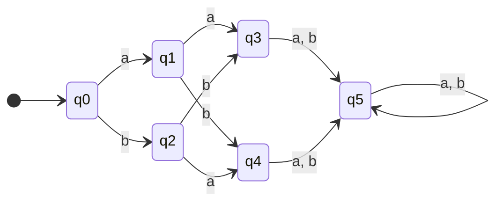

# Automata
Este é um projeto referente á matéria de teoria da computação da minha faculdade de bacharelado em engenharia da computação.

## Usagem
Para utilizar este projeto, é necessário ter Java 21 ou superior instalado na sua máquina.

### Formato em CSV
Para que este programa funcione devidamente, é necessário que seja especificada uma função de transição.
Como é absurdamente incoveniente descrever um autômato via terminal, escrever o mesmo em uma planilha(libreoffice ou excel) parece muito mais eficaz.

Por exemplo:

```
# Voce pode colocar comentários no seu autômato usando jogo da velha (#).
FUNTRANS,a,b
q0,q1,q2
q1,q3,q4
q2,q4,q3
q3,q5,q5
q4,q5,q5
q5,q5,q5
FINAIS,q1,q2,q5
INICIAL,q0
```
Representa a função de transição do seguinte autômato:


### Rodando o o projeto.
Em seu shell (CMD, PowerShell, bash, zsh, etc), digite o seguinte comando:

```
$ java -jar automato.jar [FUNÇÃO DE TRANSIÇÃO] [PALAVRA]... ```
É esperado:

FUNÇÃO DE TRANSIÇÃO --> Caminho da função de transição no formato CSV.

PALAVRA --> Testes que serão realizados seguindo o caminho do automato definido na *FUNÇÃO DE TRANSIÇÃO* especificada

Saída esperada sendo babba como palavra especificado:
```
babba ::: {q0}-->{q2}-->{q4}-->{q5}-->{q5}-->{q5} VALID
```
O programa vai dizer se a palavra é válida no final com a palavra VALID ou INVALID caso contrário.

